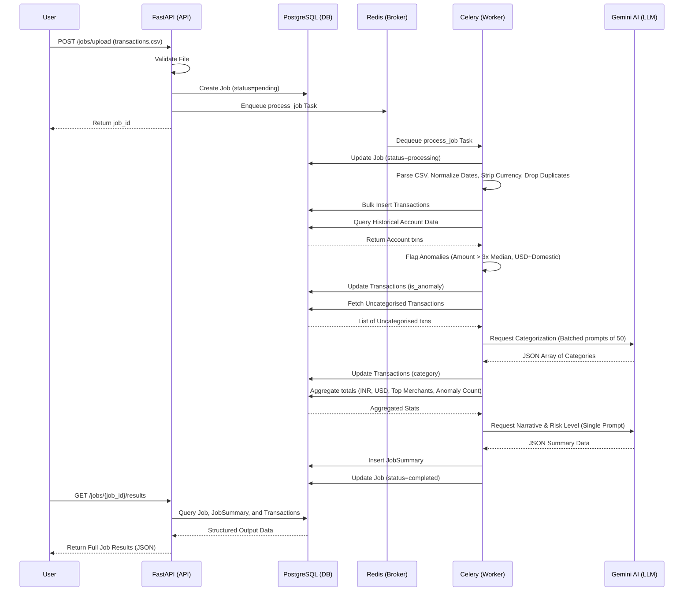

# High-Level Visual Diagram

This diagram traces the exact path a single request takes from the API endpoint to data persistence and back, satisfying the "System Design & Data Flow" requirement for your video review.

## Review Video Talking Points

1.  **The Blueprint:** Above is the request lifecycle. File goes to API -> Saved to DB as pending -> Task to Redis -> Celery picks up task -> File is parsed and cleaned in Python -> Inserted to DB -> Median anomalies calculated -> Uncategorised are sent to Gemini in a *single batched prompt* (to save rate limits/time) -> Summary is aggregated and sent to Gemini -> Job marked complete.
2.  **The "Why":** We use Celery+Redis because LLM calls are slow and can fail. A background job queue prevents the API from timing out and provides built-in exponential backoff retries for Gemini API limits. PostgreSQL is robust and relational, fitting financial data perfectly. FastAPI provides high-throughput async endpoints.
3.  **The Breaking Point (100x Scale):** If traffic scales 100x, the first bottleneck is parsing large CSVs entirely in memory within the Celery worker (OOM errors) and rate limits from the LLM provider.
4.  **The Next Iteration:** To fix the scale, I would:
    *   Stream the CSV to cloud storage (S3) instead of local disk.
    *   Use Pandas chunking or a stream parser (like Python's `csv` module row-by-row) to avoid memory spikes.
    *   Fan-out processing: have one Celery task parse the file and split it into chunks, spawning multiple smaller sub-tasks to process chunks in parallel.
